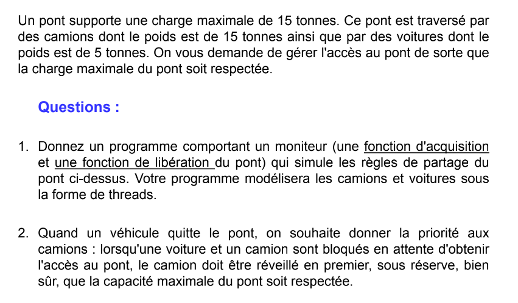

# Bridge Simulation

This program simulates a scenario where vehicles (both cars and trucks) are attempting to cross a single-lane bridge. The bridge has a weight limit, so cars and trucks must wait until it's safe to cross. It's implemented in C using POSIX threads (`pthreads`) and mutexes for synchronization.

